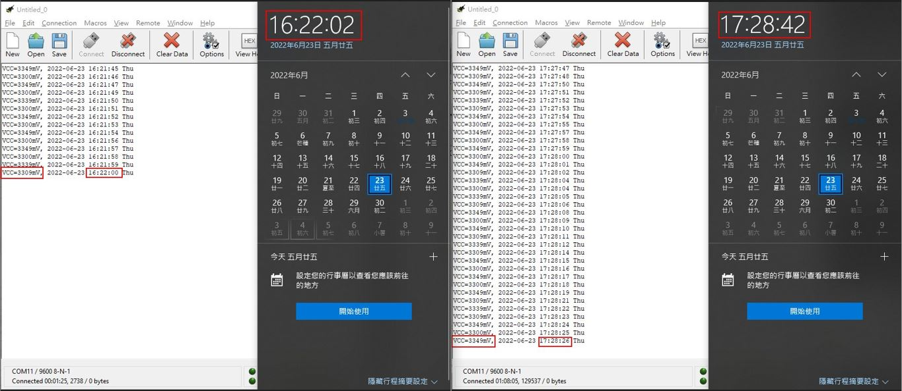
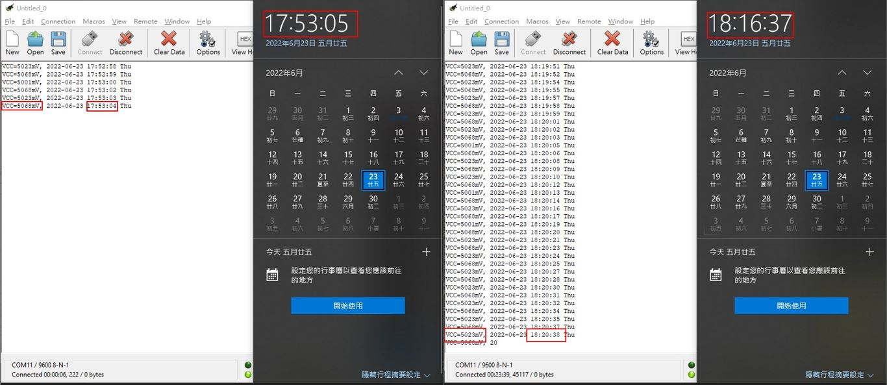
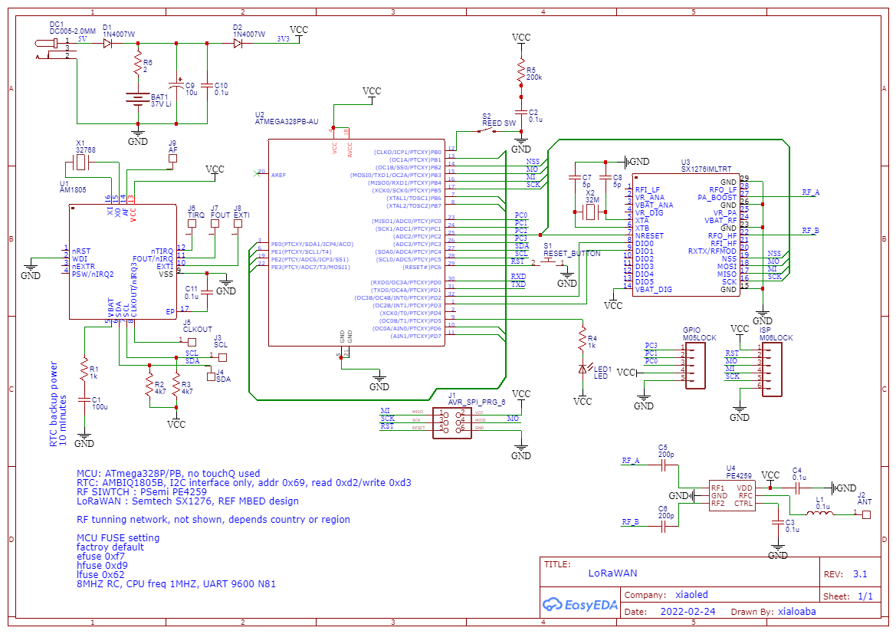

# AVR_AMBIQ1805_testing
AVR_AMBIQ1805_testing

### instresting to know
3V3 supply, no calibration, XT mode, RTC has less counts 16 seconds after one hour  
  

5V supply, for sure that it was beyond manufacturer specification limit (max3.6V)  
no calibration, XT mode, RTC has extra counts 240 seconds about 20 minutes later, propotion to an hour, it would be 720 seconds roughly.
  

### circuit
pdf [Schematic_ATmega328PB_AM1805_SX1276_2022-02-24.pdf](Schematic_ATmega328PB_AM1805_SX1276_2022-02-24.pdf)  
  

### hostware  
  
COM11 only, read PC host date, dump to MCU, MCU will set RTC AM1805  
